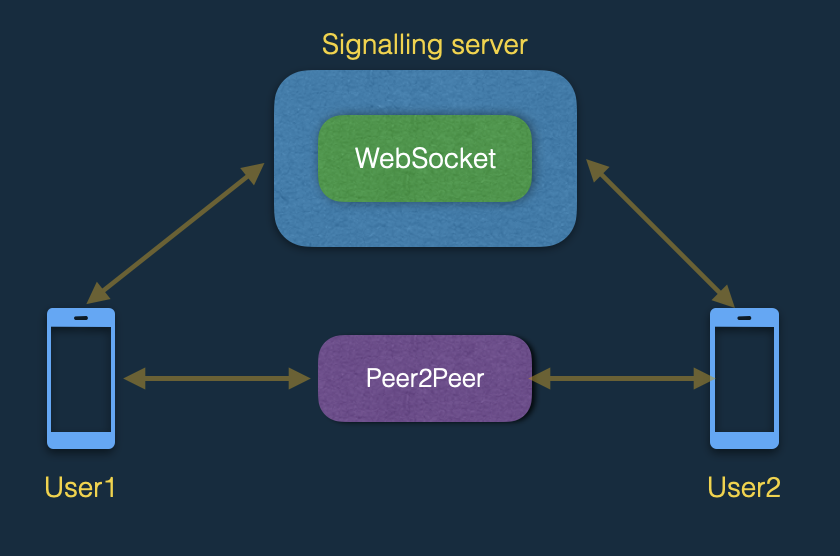
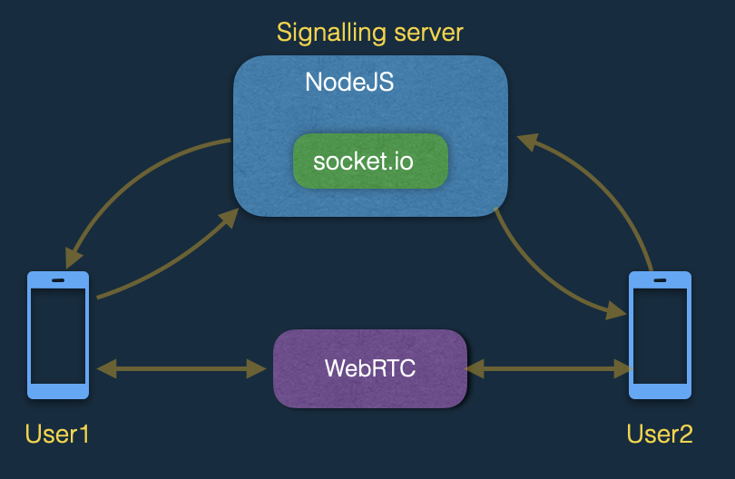
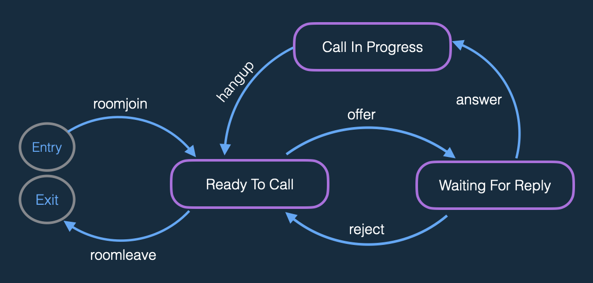
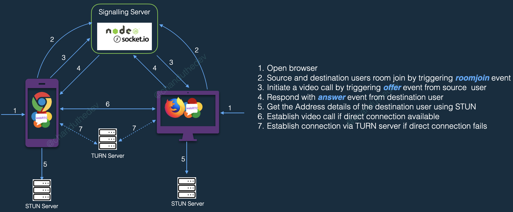

# Open-easyrtc in pictures

## 1. Modules involved in General WebRTC and its connectivity:
#### 1.a With in the same network(LAN):
1. Signalling server
2. Web-socket
3. Client with WebRTC support(browsers)

#### 1.b When multiple networks involved::
1. Signalling server
2. Web-socket
3. Client with WebRTC support(browsers)
4. STUN/TURN servers

      
## 2. Modules involved in open-easyrtc and its connectivity: 

#### 2.a With in the same network(LAN):
1. NodeJS server
2. socket.io
3. Any browser(Chrome, FireFox, Safari etc.)

#### 2.b When multiple networks involved:
1. NodeJS server
2. socket.io
3. Any browser(Chrome, FireFox, Safari etc.)
4. Public STUN server from google (stun:stun.l.google.com:19302)

      
## 3. State diagram of events while making connection between two clients:

      

## 4. Video call end-to-end flow:
1. Open browser.
2. Source and destination users room join by triggering roomjoin event.
3. Initiate a video call by triggering offer event from source  user.
4. Respond with answer event from destination user.
5. Get the Address details of the destination user using STUN.
6. Establish video call if direct connection available.
7. Establish connection via TURN server if direct connection fails.

      